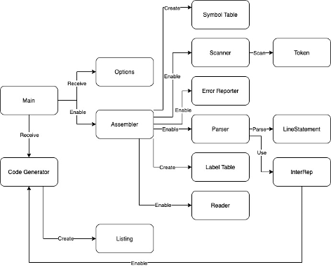
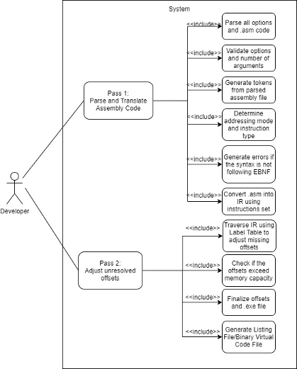
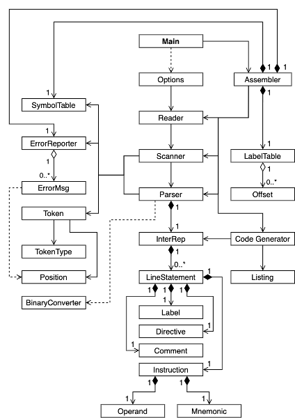
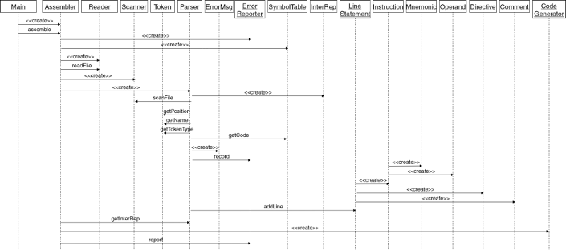
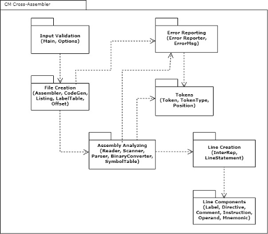

# Assembler Project

Designed Architecture and Implemented a Cm Assembler for Virtual Machines in Java

- Built to Be Cross Platform
  - Compatible with Windows, MacOs, and Linux
- Focused on Software Processes
  - Scrum w/ Bi Weekly Sprints/Releases
  - TDD for Unit and Integration Testing
  - Refactoring to Improve Architecture Based on PO's Advice
  - CI/CD using Github

## Architecture Design

### Key Concept Model

### Use Case Diagram

### Class Diagram

### Sequence Diagram

### Package Diagram

## Code Structure

Assembly Unit -> LineStatement + EOF

LineStatement -> Label + Instruction + Comment + EOL

Label -> String

Instruction -> Mnemonic + Operand

Operand -> Label (String) or main.java.Offset (Binary)

Directive: .cstring (String)

Comment (;)
If ; detected, ignore the rest of the line until you reach EOL character ("\n" | "\r" | "\r\n")
Remove useless whitespace

Assembler ends when EOF is detected (<control-Z>)

Generate pgm.exe for target and complete listing file pgm.lst with label table

## Testing Documentation

Running Tests:

1. Compile Test File: javac TestX.java
2. Run Test File and Redirect Output into .txt: java TestX > TestX.txt
3. Run Unit Test Using AUnit: java aunit TestX.txt

## Scrum Team:

[Nicholas Kawwas](https://github.com/nickawwas) \
[Nicholas Harris](https://github.com/NichHarris) \
[Matthew Sklivas](https://github.com/mattsklivas) \
[Vincent Beaulieu](https://github.com/vincbeaulieu) \
[Philippe Lee](https://github.com/Lee-Phil) \
[Karine Chatta](https://github.com/karinechatta) \
[Georgia Bardaklis](https://github.com/gbardaklis) \
[Lina Tran](https://github.com/linatran1) \
[Malek Jerbi](https://github.com/oguzgezginci)
